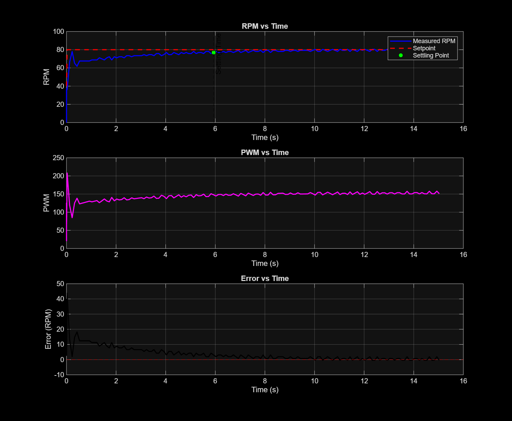

# PID Motor Speed Controller

A closed-loop PID speed controller for a geared DC motor, built on Arduino Uno with interrupt-driven quadrature encoder feedback. The PID algorithm is implemented as a reusable C++ class. Speed setpoints are sent over serial from a Python script, and the step response is logged to CSV and analyzed in MATLAB.

---

## Demo



> Motor accelerating from 40 RPM → 80 RPM setpoint. Settling time ≈ 6 seconds. Final steady-state error < ±1.2 RPM.

---

## Hardware

| Component | Details |
|---|---|
| Microcontroller | Arduino Uno |
| Motor | 25GA370 DC Geared Motor — 12V, 130 RPM rated |
| Motor Driver | L298N Dual H-Bridge |
| Encoder | Quadrature encoder, 11 PPR (on motor shaft) |
| Power Supply | 12V bench power supply |

**Wiring Diagram**


---

## Motor & Encoder Specs

| Parameter | Value |
|---|---|
| Gear Ratio | 1 : 46.8 |
| Encoder PPR (motor shaft) | 11 pulses/revolution |
| Effective PPR (output shaft) | 11 × 46.8 = **514.8 pulses/revolution** |
| Rated Speed | 130 RPM |
| Supply Voltage | 12V |

The encoder sits on the motor shaft before the gearbox. Each full revolution of the **output shaft** generates 514.8 encoder pulses on channel A.

---

## Project Structure

```
Codes/
├── read_encoder/          # Plots raw encoder A and B channels — verifies wiring and direction
├── read_encoder_position/ # Interrupt-driven position counter — verifies pulse counting
├── read_rpm/              # Timed sampling window converts pulse count to RPM
├── PID_speed_control/     # Full closed-loop PID speed controller (main project)
│   ├── src/main.cpp       # Arduino main loop — encoder, RPM, serial command interface
│   ├── src/PIDController.cpp  # PID class implementation
│   └── include/PIDController.h    # PID class declaration
├── python_serial/
│   └── send_step_response.py  # Sends step command over serial, logs response to CSV
└── matlab_step_response.m     # Loads CSV, plots RPM/PWM/error, detects settling time

Data/
├── step_response.csv      # Logged step response data (40 → 80 RPM)
├── step_response.png      # MATLAB step response plot
├── Motor circuit connection.png  # Full wiring diagram
└── Encoder/               # Motor datasheet, encoder connection diagram, reference PDF
```

---

## PID Controller Design

The PID class (`PIDController.h / .cpp`) is implemented in pure C++ with no Arduino dependencies — portable to STM32, AVR, or any C++ environment.

```cpp
PIDController speed_PID(3.0, 1.5, 0.0);
float output = speed_PID.compute(setpoint, measured_RPM, dt);
```

**Tuned gains:**

| Gain | Value | Role |
|---|---|---|
| Kp | 3.9 | Proportional — drives motor toward setpoint |
| Ki | 1.5 | Integral — eliminates steady-state error |
| Kd | 0.0 | Not needed — encoder noise outweighs benefit |

**Tuning process:** Started with Kp only (Ki=Kd=0) and increased until the motor approached setpoint without oscillating. Added Ki to eliminate the remaining steady-state error. Kd was tested but introduced noise from the encoder resolution at 100ms sampling, so it was left at zero.

**Anti-windup:** Integral term is clamped to ±200 to prevent unbounded accumulation during large setpoint changes.

---

## How to Use

**1. Flash the Arduino**

Open `Codes/PID_speed_control/` in PlatformIO and upload to Arduino Uno.

**2. Send a speed setpoint over serial**

Open any serial monitor at 115200 baud and type a target RPM (e.g. `80`) followed by Enter. The motor will ramp to that speed.

**3. Run the Python step response logger**

```bash
cd Codes/python_serial
python send_step_response.py
```

The script sends 40 RPM, waits 5 seconds for stabilization, then sends 80 RPM and logs 15 seconds of data to `step_response.csv`.

**4. Analyze in MATLAB**

Open `Codes/matlab_step_response.m`, ensure `step_response.csv` is in the working directory, and run. The script plots RPM, PWM, and error over time and prints the settling time to the console.

---

## Results

| Metric | Value |
|---|---|
| Setpoint | 80 RPM |
| Steady-state RPM | 79.25 – 80.42 RPM |
| Steady-state error | < ±1.2 RPM |
| Settling time (5% band) | ≈ 6 seconds |
| Steady-state PWM | ≈ 150 / 255 |

---

## What I Learned

- **Interrupt-driven encoder reading** — using `attachInterrupt()` on Arduino with a minimal ISR that only increments a counter, never blocking
- **Atomic volatile reads** — using `noInterrupts()` / `interrupts()` to safely read a multi-byte `volatile long` on an 8-bit AVR without data corruption
- **C++ class design** — separating a PID controller into `.h` and `.cpp` files in PlatformIO, with no Arduino dependencies for portability
- **PID tuning methodology** — tuning Kp, Ki, Kd in sequence by observing step response behavior rather than guessing
- **Python serial logging** — using `pyserial` to automate setpoint commands and log timestamped CSV data
- **MATLAB step response analysis** — using `readtable()`, `datetime()`, subplots, and settling time detection on real hardware data